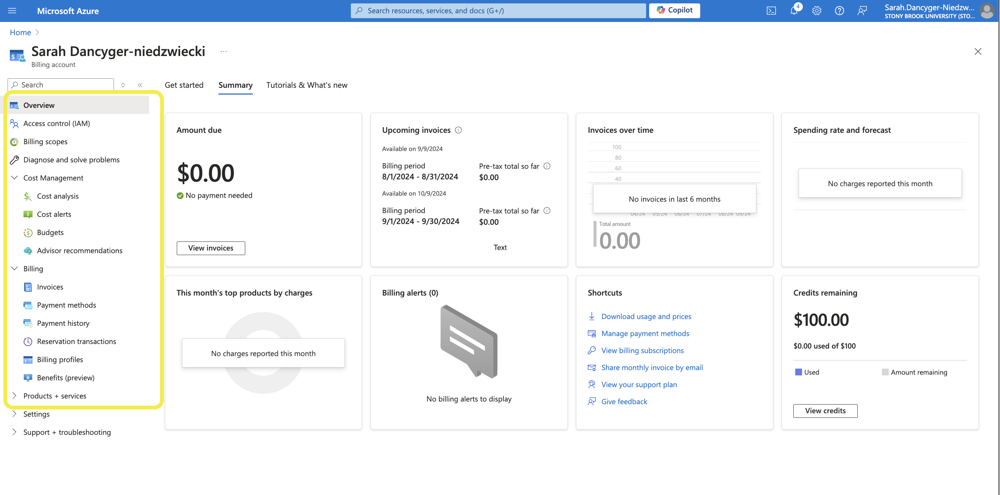
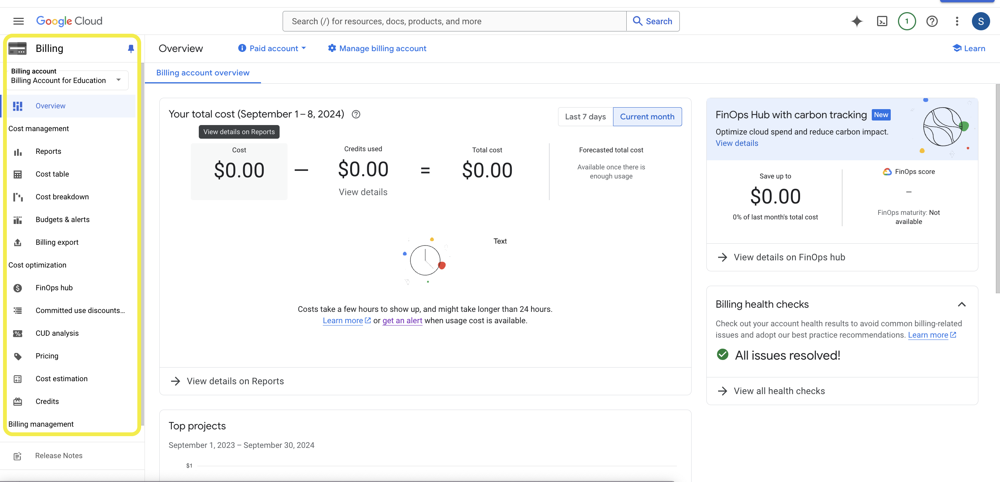
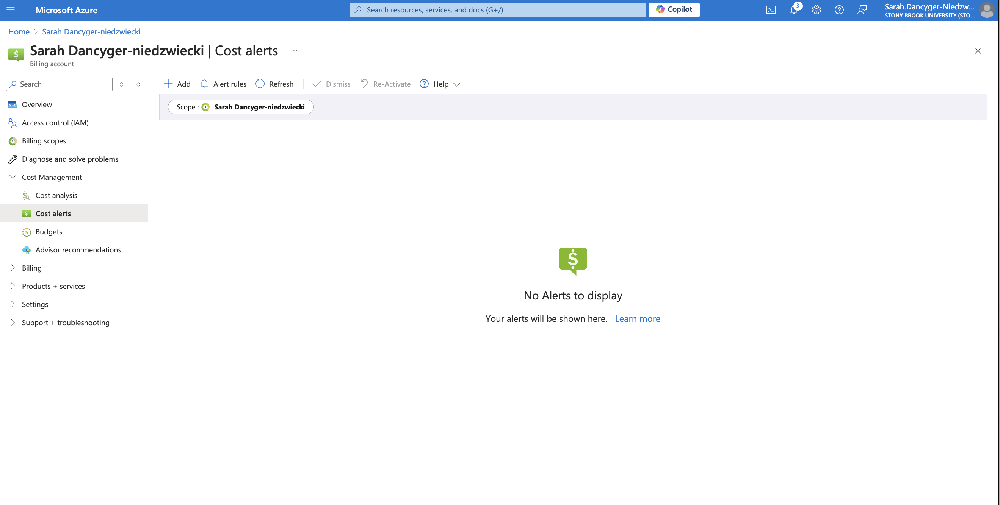
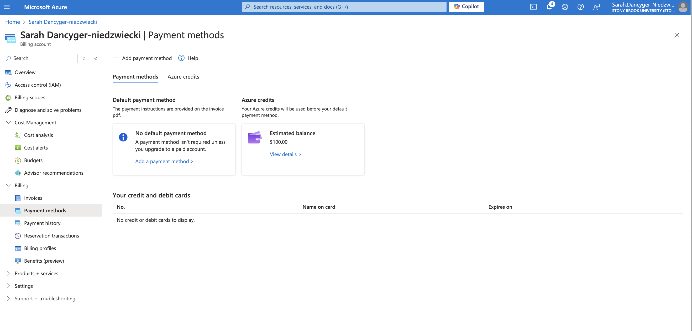

# HHA504_assignment_cloudcosts

## Exploring Cost Management and Billing on Azure and GCP

*Objective:
    The objective of this assignment is to introduce you to the cost management and billing interfaces of Azure and Google Cloud Platform (GCP). By the end of this assignment, you will be able to navigate these platforms to understand how cloud costs are tracked and managed.*

# EXPLORATION OF FEATURES

## Azure Explored

## Google Cloud Explored

# MICROSOFT AZURE

## Cost Management

## *Overview*

## *Billing Scopes*

## *Cost Analysis*

## *Cost Alert*

## *Budgets*

## *Budget of $8.00*

## *Advisor Recommendations*

# MICROSOFT AZURE 

## Billing

## *Invoices*

## *Payment Methods*

## *Payment History*

## *Reservation Transactions*

## *Billing Profiles*

## *Billing Benefits*

# GOOGLE CLOUD
## Cost Management and Billing Features

## *Overview*

## *Reports*

## *Cost Table*

## *Cost Breakdown*

## *Budgets and Alerts*

## *Budget of $8.00*

## *Billing Support*

# REFLECTION
I found the cost management features of both Azure and Google Cloud to be very clear and understandable. Both platform's layout made it very easy for me to visually locate and understand the purpose of each feature. I reviewed the various features highlighted in the first two images (within the yellow box). I found that the "budget" feature was very helpful on both Azure and Google Cloud. This feature allowed me to create a budget of $8.00, and also allowed for a notification to present when 80% of my limit is reached ($6.40). Also, additional alert notifications for other threshold amounts can be established if inputted. The "cost analysis" feature on Microsoft Azure, and the "reports" feature on Google Cloud did not contain any data as no spending occurred. However, when spending *does* occur, both these pages would allow me to view various facets such as "service used" and "cost".

